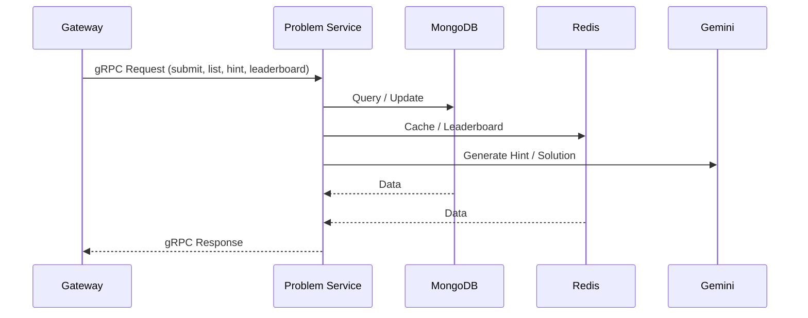

# Codex Problem Service

The Problem Service manages the core competitive-programming logic of the Codex platform. It handles problem CRUD, submission workflow, leaderboard computation, and AI-assisted hints and solutions. It exposes gRPC APIs and communicates with the Auth User Service via a gRPC client.

---

## 1. Service Overview

The Problem Service owns the platform's competitive programming logic:

* Problem CRUD (admin)
* Submission lifecycle (create, update, status tracking)
* Leaderboard (global and country) via Redis sorted sets + hash sets
* AI hints and full-solution generation using Gemini
* User dashboard data (streaks, heatmap, recent activities)
* Cursor-based pagination for submissions
* Caching layers for performance and load reduction
* gRPC server + gRPC client to Auth-User Service
* Distributed tracing for gRPC, MongoDB and Redis

---

## 2. High-Level Architecture

```
Client → gRPC Server
       → Handler (ProblemHandler or SubmissionHandler)
       → submissionService / problemService
       → repository layer
       → cache / leaderboard / AI / user-service
       → response
```

---

## 3. Responsibilities

### Core Responsibilities

* Business logic for problems and submissions
* Score calculation, streak logic, heatmap creation
* Leaderboard state and ranking
* AI-powered hint generation and solution generation
* Efficient caching and distributed tracing

### Not Responsible For

* Authentication
* HTTP endpoints (handled by Gateway)
* Code execution (managed by Code Manage + Code Execution services)

---

## 4. Tech Stack

* **Node.js + TypeScript**
* **gRPC server & client**
* **MongoDB (Mongoose)**
* **Redis**, for:

  * cache
  * leaderboard ZSETs
  * username hashing
  * problems solved counts hasing
* **OpenTelemetry** tracing for gRPC, MongoDB, Redis
* **InversifyJS** for dependency injection
* **Gemini** for hints and solutions

---

## 5. Folder Structure (Simplified)

```
src/
  config/            # db, redis, tracing, DI container, gemini
  db/                # mongoose models + interfaces
  services/          # problem & submission business logic
  repos/             # Mongo repositories
  libs/              # leaderboard + cache abstractions
  dtos/              # request/response DTOs + mappers
  transport/grpc/    # gRPC server + client
  utils/             # logger, error handlers, metrics
  index.ts           # service bootstrap
```

---

## 6. gRPC Architecture



---

## 7. Major Components

### **Problem Service**

-Create, update, list problems
-Manage test cases and template code
-Provide problem metadata for submissions

### **Submission Service**

-Create submissions
-Update submission result after execution
-Calculate scores and update leaderboard
-Handle AI hints + solution generation

### **Leaderboard System**

-Global ZSET
-Country ZSETs
-Usernames, problems solved hashes
-Ranking + hydration logic

### **Caching Layer**

Caches:

* heatmap
* streak
* leaderboard snapshot
* recent activity
* solution and hint results

---

## 8. Observability

### Tracing

* gRPC server and client spans
* Mongo queries
* Redis commands

### Logging

* Structured Pino logs
* Per-operation metadata (userId, problemId, submissionId)

### Metrics

* Custom metrics middleware for latency, request count, error rate

---

## 9. CI/CD Pipeline

```mermaid
flowchart LR
    DevPush[Push to dev/feature] --> GH[GitHub Actions]
    GH --> Lint[Lint + Type Check]
    Lint --> TestBuild[Test Build]
    TestBuild -->|Merge to main| BuildProd[Build Production Image]
    BuildProd --> DockerHub[Push to Docker Hub]
    DockerHub --> Argo[ArgoCD Image Updater]
    Argo --> GKE[GKE Rolling Update]
```



### Summary

* Feature/dev push triggers validation build
* Main branch merge triggers: build + push image
* ArgoCD Image Updater pulls new image
* GKE performs a controlled rollout

---

## 10. Local Development

Install dependencies:

```
npm install
```

Run locally:

```
npm run dev
```

Build:

```
npm run build
```

NB : DockerFile can be use to run as container.

---

## 11. License

MIT
